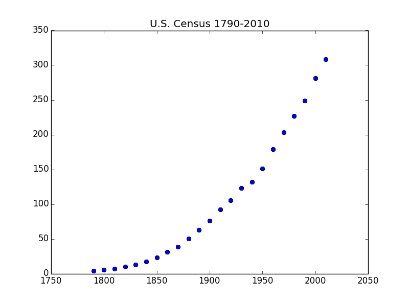
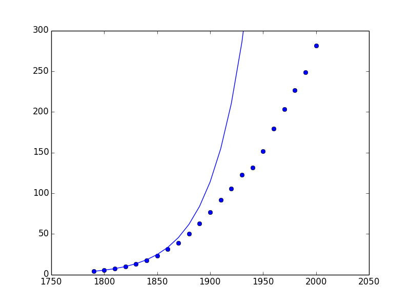
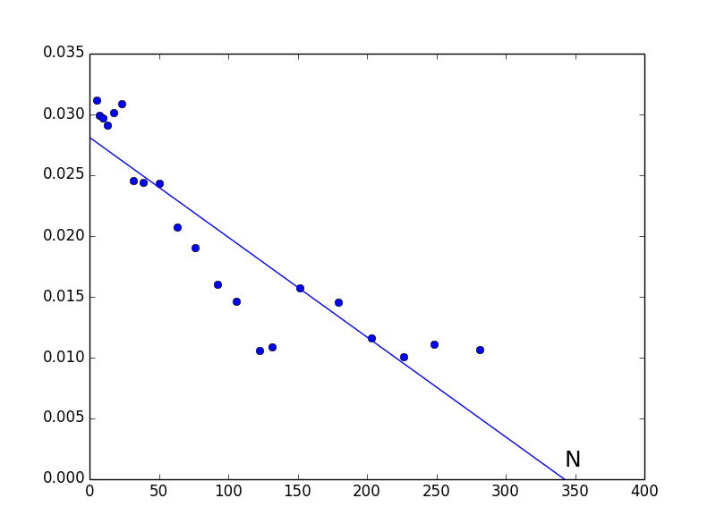
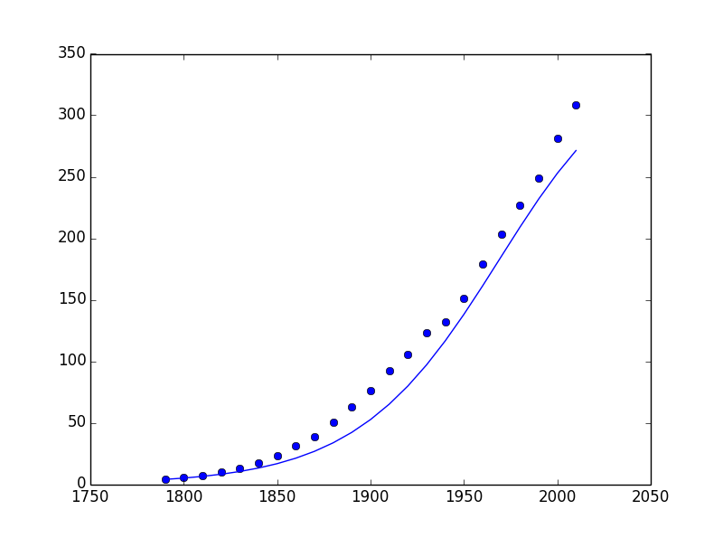

#通过微分方程建模
##1 数学建模（Mathematical Modeling）
数学建模是用数学公式来描述现实世界中现象的过程，其主要任务是识别关键数量以及发现这些数量之间的数学关系，通常通过如下三步实现：  
1. 提出**前提假设（assumption）**  
2. 识别相关的**变量**和**参数**  
3. 根据1中前提假设对2中的变量构建**数学公式**   

数学模型中的数量可以分为三种：   
1. **自变量（independent variable）**
2. **因变量或简称变量（dependent variable）**
3. **参数（parameter）**

用微分方程来构建的数学模型的前提假设中通常会包含导数，其文字表述通常会包含**“增长率（rate of increase）”**、**“变化率（rate of change）”**、**“速度（velocity）”**、**“加速度（acceleration）”**一类词语。    

例：跳伞  
1. 前提假设：跳伞者只收到重力和摩擦力影响，摩擦力与速度的平方成正比，以及牛顿第二定律：$$F=ma$$。  
2. 变量：  
    + 自变量：t 时间（秒）  
    + 因变量：v 速度    
    + 参数：   
        1. g 重力常数  
        2. m 跳伞者的质量  
        3. k 阻力的系数  
3. 建模：  
    + 等式左边，跳伞者收到的力：$$F=mg-kv^2$$   
    + 等式右边：$$m\frac{dv}{dt}$$    
    + 模型为：$$mg-kv^2=m\frac{dv}{dt}$$  

得到的模型：$$mg-kv^2=m\frac{dv}{dt}$$是**一阶常微分方程（first order ordinary differential equation）**，其解法是去寻找一个满足方程的函数$$v(t)$$。  

##2 建模人口增长  
用微分方程建模美国人口增长。  
```
    # libararies
    import numpy as np
    import matplotlib.pyplot as plt 
    
    # the data
    USPop = np.array([3.9,5.3,7.2,9.6,12.9,
                      17.1,23.2,31.4,38.6,50.2,
                      63.0,76.3,92.0,105.7,122.8,
                      131.7,151.3,179.3,203.3,226.5,
                      248.7,281.4,308.7])
                      
    Year = np.array(range(1790,2011,10))
    
    # plotting the data as scatter plot
    plt.plot(Year,USPop,'bo')
    plt.title("U.S. Census 1790-2010")
```
  

先看一个最简单的模型：**马尔萨斯增长模型（Malthusian Growth Model）**  
1. 前提假设： 人口的增长速率与人口数量成正比  
2. 变量： 
    + 自变量: t 时间（年，从1790年开始）
    + 因变量：p 人口 （百万）  
    + 参数：  
        1. k 人口的增长速率与人口数量所成的比率   
3. 模型：  
    + 等式左边，人口的增长率：$$\frac{dp}{dt}$$    
    + 等式右边：$$kp$$  
    + 模型为：$$\frac{dp}{dt}=kp$$  

在获得模型后，我们的目标是：找到一个满足公式的函数$$p(t)$$  

方法一**分析方法（Analytic Method）**：  
$$\frac{dp}{dt}=kp\\
 \frac{1}{p}\frac{dp}{dt}=k\\
 \int\frac{1}{p}\frac{dp}{dt}dt=\int{k}dt\\
 \int\frac{1}{p}dp=kt+C\\
 \ln(p)=kt+C\\
 p=e^{kt+C}\\
 p=e^{kt}e^C\\
 p=Ke^{kt}\\
 p(t)=Ke^{kt}
 $$  

若我们通过$$1790$$年和$$1800$$年的数据来拟合模型，则：  
$$p(0)=K=3.9$$  
$$p(10)=3.9e^{10k}=5.3\implies k = 0.03067$$  
因此模型为：$$p(t)=3.9e^{0.03067t}$$  
绘图看一下模型的好坏：  
```
    # library
    import sympy
    from sympy.abc import t
    from sympy import E as e
    
    # model
    p = 3.9*e**(0.03067*t)
    
    # domain
    domain = np.array(range(0,len(USPop)*10,10))
    
    # plot actual data and model prediction
    plt.plot(Year,USPop,'bo')
    plt.plot(Year,[p.subs(t,year) for year in domain])
    # limit the y axis to see the lower part of the graph
    plt.axis(ymax = 300)
```
    

看到1850年前，模型的预测与真实值还是较为吻合的，之后出现较大偏差。  

##**3 有限资源与罗吉斯特人口模型**  
因为自然资源是有限的，因此人口的增长会受到限制，因此对上面的模型进行如下修改：  
+ 人口数量较少时，人口的增长速率与人口数量成正比  
+ 随着人口的增长，人口的**相对增长率（relative growth rate）**逐渐减小   
人口的相对增长率定义为：  
$$\text{relative growth rate} = \frac{(\frac{dp}{dt})}{p}=\frac{1}{p}\frac{dp}{dt}$$   

罗吉斯特人口模型：  
1. 前提假设：人口的相对增长率与人口数量之间呈反比  
2. 变量： 
    + 自变量: t 时间（年，从1790年开始）
    + 因变量：p 人口 （百万）  
    + 参数：  
        1. k
        2. m 人口增长速度随人口数量变化而变化的比率  
3. 模型：  
    + 等式左边，人口的相对增长率：$$\frac{1}{p}\frac{dp}{dt}$$    
    + 等式右边：$$k+mp$$  
    + 模型为：$$\frac{1}{p}\frac{dp}{dt}=k+mp$$  

方法二**数值方法（Numerical Method）**  
模型$$\frac{1}{p}\frac{dp}{dt}=k+mp$$是一条直线，需要拟合的是参数k和m，看一下手头的数据：  

| t | p |
| -- | -- |
| 0 | 3.9 |
| 10 | 5.3 |
| 20 | 7.2 |  

从导数的切线解读出发，可以做如下估计：  
$$\frac{dp}{dt}\bigg|_{t=10}\approx\frac{p(20)-p(0)}{20}= 0.165 $$  
因此相对增长率$$\frac{1}{p}\frac{dp}{dt}\bigg|_{t=10}=\frac{1}{5.2}\times 0.165=0.03173076923076923$$
类似地，可以计算各个时刻的相对增长率，画图后可以发现，相对增长率大致可以用直线来拟合,拟合一条回归线。    
```
    # calculate relative growth rate
    rgr = [1.0/USPop[i]*(USPop[i+1]-USPop[i-1])/20 for i in range(1,len(USPop)-1)]
    
    # fit a line to the data
    slope, intercept = np.polyfit(USPop[1:-1],rgr,1)
    print slope, intercept
    # result is: -8.2111607647e-05 0.0280801486169
    
    # make a plot
    plt.plot(USPop[1:-1],rgr,'bo')
    plt.plot(np.array(range(0,350)),slope*np.array(range(0,350))+intercept)
    plt.text(344,0.001,'N',fontsize = 18,color="black")
    plt.axis(ymin = 0)
    plt.axis(xmax = 400)
```
    

得到人口的相对增长率函数为:$$\frac{1}{p}\frac{dp}{dt}=0.02808 + 0.000082111\times p$$  
因此得到微分方程：$$\frac{dp}{dt}=0.02808p+0.000082111\times p^2$$   
该微分方程的分析解法留给后面介绍，先用欧拉方法试一试该微分方程的近似效果如何：  
```
    # euler's method
    from sympy.abc import p
    pred = [3.9]
    rgrf = intercept*p-slope*p**2
    # step is 10
    for i in range(22):
        pred.append(rgrf.subs(p,pred[-1])*10+pred[-1])
    
    # make a plot
    plt.plot(Year,USPop,'bo',Year,pred)
    plt.axis(ymax = 400)
```
  

发现近似效果比之前的马尔萨斯增长模型要更加好。

##**4 定性分析（Qualitative analysis）**    


