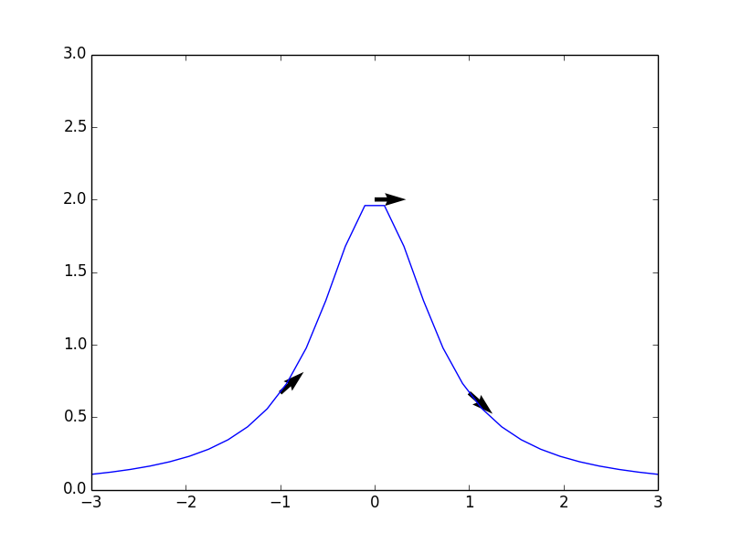
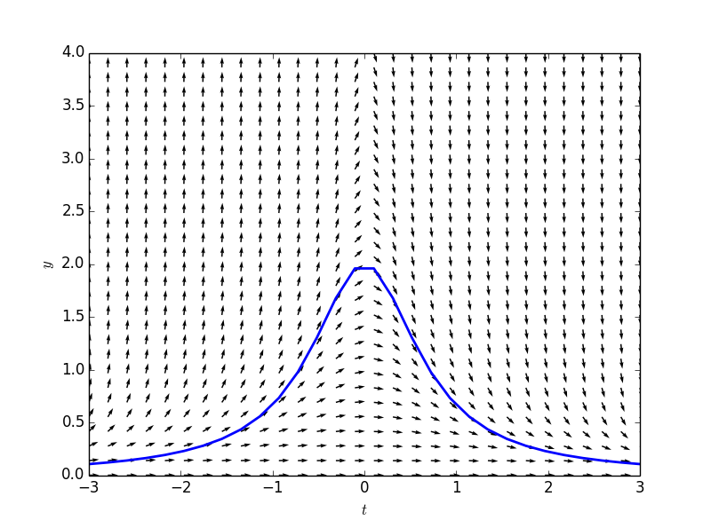
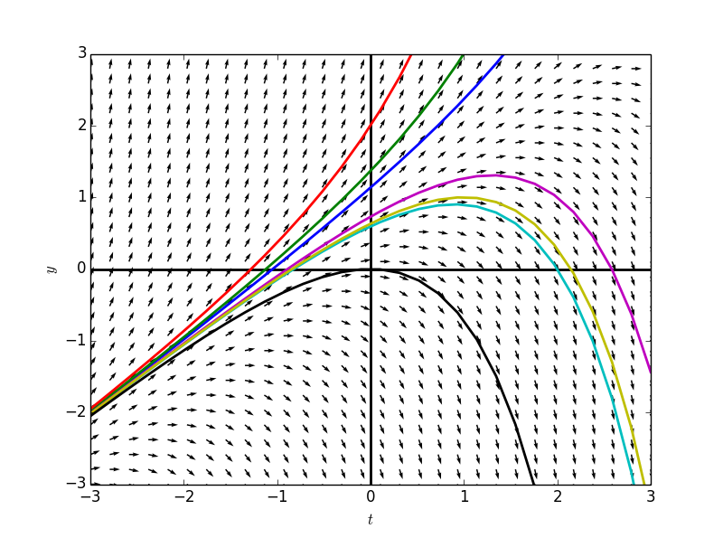
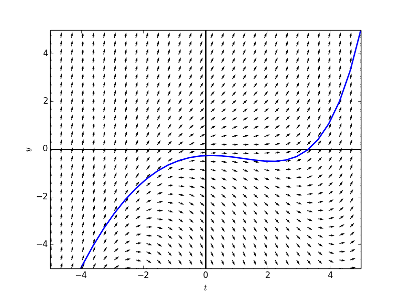
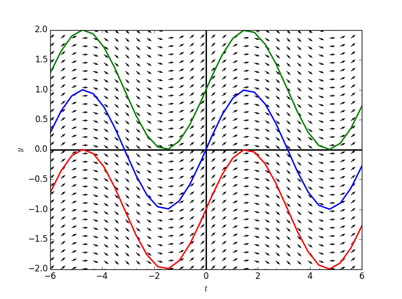
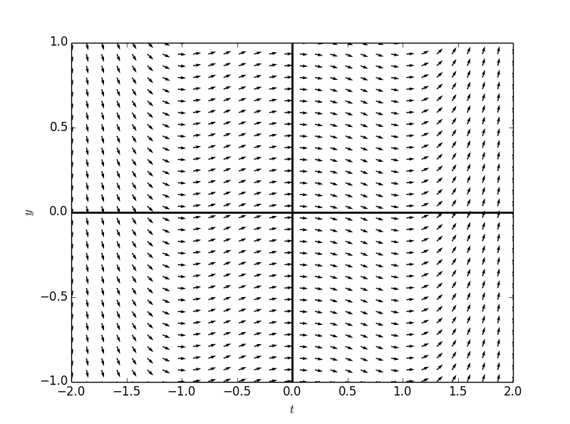
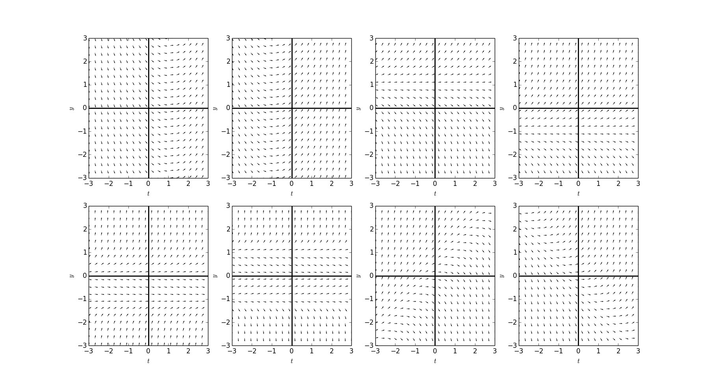

#斜率场
##**斜率场（slope field）**  
微分方程$$\frac{dy}{dt}=f(t,y(t))$$的右边：$$f(t,y(t))$$定义了一个斜率场，即在$$t-y$$平面上的一张可以用来描述该微分方程的图。  

取$$t-y$$平面上的任意一点$$(t_i,y_i)$$，则$$f(t_i,y_i)$$表示的是经过该点的微分方程解在该点处切线的斜率。  


例如之前章节中涉及的微分方程：$$\frac{dy}{dt}=-2ty^2$$  

知道其解形式为：$$y(t) = \frac{1}{t^2+C}$$  
若给定初值$$y(0)=2$$，其解为：$$y(t)=\frac{1}{t^2+\frac{1}{2}}$$  
下面列举该解所经过的几个点，以及相应位置切线的斜率：  

| $$(t,y)$$ |$$ f(t,y)$$ |$$ y'(t) $$|
| -- | -- | -- |
| $$(0,2)$$ | 0 | 0 |
| $$(-1,\frac{2}{3})$$ | $$\frac{8}{9}$$ | $$\frac{8}{9}$$ |
| $$(1,\frac{2}{3})$$ | $$\frac{8}{9}$$ | $$\frac{8}{9}$$ |

绘图表示为：  
```
    # library
    import matplotlib.pyplot as plt
    from sympy.abc import t
    import numpy as np
    
    # define the function 
    y = 1.0/(t**2+1.0/2)
    
    # sample domain
    domain = np.linspace(-3,3,30)
    
    # calculate 3 slopes at tabled position
    T = np.array([-1,0,1])
    Y = np.array([2.0/3,2,2.0/3])
    U = 2
    V = -2*T*Y**2
    N = np.sqrt(U**2+V**2)  
    U2, V2 = U/N, V/N
    
    # make the plot
    plt.plot(domain, [y.subs(t, tval) for tval in domain])
    plt.quiver( T,Y,U2, V2)
    plt.xlim([-3,3])
    plt.ylim([0,3])
```
  

下面是微分方程的斜率场，箭头代表的含义是：取$$t-y$$平面上的一个点，找到经过该点的微分方程的解（函数y(t)），求出该函数在该点处切线的方向，将该方向用箭头表示。

```
    import matplotlib.pyplot as plt
    from sympy.abc import t
    import numpy as np

    f = 1.0/(t**2+1.0/2)
    domain = np.linspace(-3,3,30)
    
    T,Y = np.meshgrid(domain,np.linspace(0,4,30) )
    U = 1
    V = -2*T*Y**2
    N = np.sqrt(U**2+V**2)  
    U2, V2 = U/N, V/N
    
    fig = plt.figure(num=1)
    ax=fig.add_subplot(111)
    ax.quiver( T,Y,U2, V2)
    plt.plot(domain,np.array([f.subs(t, tval) for tval in domain]), linewidth= 2)
    plt.xlim([-3,3])
    plt.ylim([0,4])
    plt.xlabel(r"$x$")
    plt.ylabel(r"$y$")
    plt.show()
```
    

在斜率场图中，任选一点，可以不断沿着斜率方向向前、向后绘制出函数图，而该函数图即为经过所选点的微分方程的解。    
下面绘制出微分方程$$\frac{dy}{dt}=y-t$$的斜率场，并且选中若干点：$$(2,4),(1,3),(0,2),(2,0),(2,1),(1,1),(0,0)$$，分别绘制出相应的解的函数图。  
```
    def plotSlopeField(tdomain,ydomain,formula,points = []):
        # initialize figure
        fig = plt.figure(num=1)
        
        # create grid
        T,Y = np.meshgrid(tdomain,ydomain )
        
        # calculate slope vectors
        U = 1
        V = np.array([[formula.subs({y(t): yval, t: tval}) for tval in tdomain] for yval in ydomain],dtype = 'float')
        N = np.sqrt(U**2+V**2)  
        U2, V2 = U/N, V/N
        
        # make the plot
        plt.quiver( T,Y,U2, V2)
        plt.xlabel(r"$t$")
        plt.ylabel(r"$y$")
        plt.axhline(0,0,1,linewidth = 2, color = 'black')
        plt.axvline(0,0,1,linewidth = 2, color = 'black')
    
        # solve the differential equation
        from sympy import Derivative, dsolve
        try:
            solutions = dsolve(Derivative(y(t),t)-formula,y(t)).args[1]
        except:
            solutions = 0
        
        # plot the solutions through the given points
        if points != []:
            for p in points:
                from sympy import Eq, solve
                C1 = solve(Eq(solutions.subs(t,p[0]),p[1]))[0]
                solution = solutions.subs('C1',C1)
                plt.plot(tdomain, np.array([solution.subs(t,tval) for tval in tdomain],dtype= 'float'),
                        linewidth = '2')
        
            # limiting the axes
            plt.xlim([tdomain[0],tdomain[-1]])
            plt.ylim([ydomain[0],ydomain[-1]])
            
        
        
        return fig
    
    domain = np.linspace(-3,3,30)
    from sympy.abc import t
    from sympy import Function
    y = Function('y')
    formula = y(t) - t
    
    fg = plotSlopeField(domain,domain,formula,[(2,4),(1,3),(0,2),(2,0),(2,1),(1,1),(0,0)])
    fg.show()
```
    

## exercise: 
绘制$$y'=y/2 + (.2)(t-1)^2$$的斜率场，找到经过$$(5,5)$$的解。
```
    formula2 = 0.2*(t - 1)**2 + 0.5*y(t)
    domain2 = np.linspace(-5,5,30)
    fg2 = plotSlopeField(domain2,domain2,formula2,[(5,5)])
    fg2.show()
```
    

##特例1

两个值得我们特别注意的特例：  
$$\frac{dy}{dt}=f(t)$$   
即右边只包含$$t$$，若给定一个$$t$$值$$t_0$$，则经过该点垂直于$$t$$轴的直线$$t=t_0$$上的任意一点在斜率场中的方向均相同（平行）。  
任意一个解都可以视为是将另一个解沿着竖直方向移动获得的。

例如：$$\frac{dy}{dt}=cost$$  
一般解为:$$y(t)=(sint)+C$$  
其中$$C$$是任意常数，不同的解之间只有常数项不同，相当于将$$sint$$的函数图，沿着竖直方向移动获得的。  
```
    import sympy
    formula3 = sympy.cos(t)
    tdomain3 = np.linspace(-6,6,30)
    ydomain3 = np.linspace(-2,2,30)
    fg3 = plotSlopeField(tdomain3,ydomain3,formula3,[(0,0),(0,1),(0,-1)])
    fg3.show()
```


## 练习：
Use dfield to plot the slope field for $$\frac{dy}{dt}=t(t^2−1)$$ on a window with −2≤t≤2 and −1≤y≤1.
```
    formula4 = t*(t**2-1)
    tdomain4 = np.linspace(-2,2,30)
    ydomain4 = np.linspace(-1,1,30)
    fg4 = plotSlopeField(tdomain4,ydomain4,formula4)
    fg4.show()
```
    

##特例2 
另一个特例是：  
$$\frac{dy}{dt}=f(y)$$     
这样的斜率场是沿着水平直线上的各点的斜率方向均平行的。  
任意一个解都可以视为是将另一个解沿着水平方向移动获得的。
例如：  
$$\frac{dy}{dt}=y(1-y)$$   
其一般解为：
$$y(t)=\frac{e^t}{1+e^t}$$     

```
    formula5 = y(t)*(1-y(t))
    tdomain5 = np.linspace(-8,8,30)
    ydomain5 = np.linspace(-1,2,30)
    fg5 = plotSlopeField(tdomain5,ydomain5,formula5,[(1,1),(1,0.5),(-2,0.5),(3,0.5)])
    fg5.show()
```


## 练习：

```
    formulas = [t-1,
                t+1,
                y(t)+1,
                y(t)-1,
                y(t)**2+y(t),
                y(t)*(y(t)**2-1),
                y(t)-t,
                y(t)+t]
    tdomainm = np.linspace(-3,3,20)
    ydomainm = np.linspace(-3,3,20)

    for i in range(len(formulas)):
        plt.subplot(2,4,i+1)
        plotSlopeField(tdomainm,ydomainm,formulas[i],[])

    plt.show()
```
  

