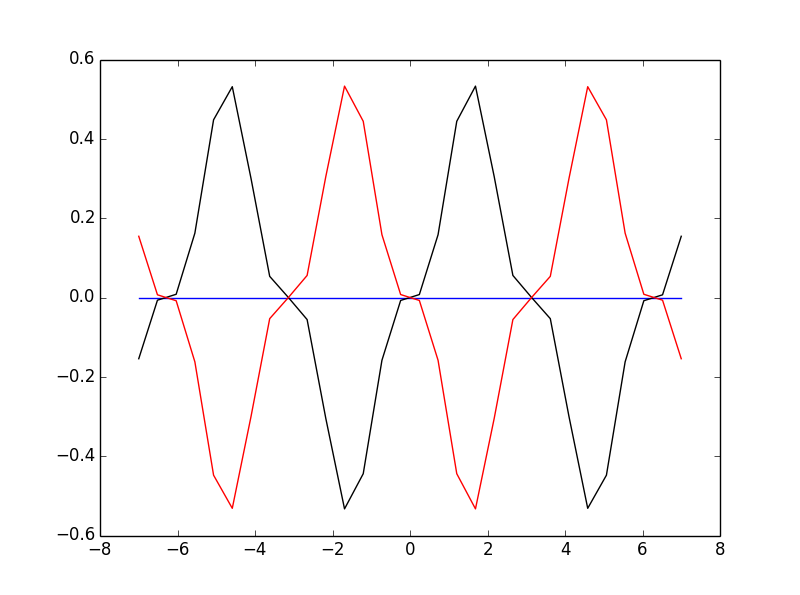

#微分方程解的存在性和唯一性   
##微分方程的定义域  
$$\frac{dy}{dt}=f(t,y)$$
定义微分方程的定义域为：  
所有使得$$f(t,y)$$有意义的$$t-y$$平面范围。  

例如：
$$\frac{dy}{dt} = y^3+t^2$$  
$$\frac{dy}{dt} = y^2$$   
的定义域都是整个$$t-y$$平面  
$$\frac{dy}{dt} = \frac{y}{t}$$   
的定义域是整个$$t-y$$平面除去$$y$$坐标  

##存在性定理：  

如果$$f(t,y(t))$$在范围$${(t,y)| a<t <b, c< y<d}$$内是连续的，给定一个在该范围内的初值$$y(t_0)=y_0$$，则存在一个$$\epsilon >0$$，当$$t_0-\epsilon < t < t_0 + \epsilon $$时，初值问题有解。  

例如：
$$\frac{dy}{dt}=1+y^2,\qquad y(0) = 0$$
方程右边$$1+y^2$$在$$t-y$$平面是连续的，满足定理条件。  
通过分离变量法求得$$y(t)=tan(t+C)$$
带入初值，求出$$C = 0$$，因此解为$$y(t)=tan(t)$$  
```
    import sympy
    from sympy.abc import t
    from sympy import Function, Derivative, dsolve, Eq
    y = Function('y')
    formula = 1+y(t)**2
    solutions = dsolve(Eq(Derivative(y(t),t),formula))
    print solutions
    # result is : y(t) == -tan(C1 - t)
    solution = solutions.args[1].subs('C1',solve(Eq(solutions.args[1].subs(t,0),0))[0])
    print solution
    # result is : tan(t)
```
知道$$tan(t)$$的定义域为$$(-\frac{\pi}{2},\frac{\pi}{2})$$  
意味着本例子中$$\epsilon = \frac{pi}{2}$$

##唯一性定理

先看一个微分方程初值问题的例子：
$$\frac{dy}{dt}=\sqrt[3]{y}sin(2t), \qquad y(0)=0$$  
考虑下面三个函数，看函数图：  
1. 蓝色（平衡解）：  
    $$y_1(t) = 0, \forall t \in \mathbb{R}$$
2. 黑色：   
    $$y_2(t) = \sqrt{\frac{8}{27}}sin^3t$$
3. 红色：    
    $$y_2(t) = -\sqrt{\frac{8}{27}}sin^3t$$
```
    tdomain = np.linspace(-7,7,30)
    
    formula = sympy.root(y(t),3)*sympy.sin(2*t)
    
    solution1 = 0
    solution2 = (8.0/27)**0.5*(sympy.sin(t))**3
    solution3 = -1*(8.0/27)**0.5*(sympy.sin(t))**3
    
    plt.plot(tdomain, [0 for i in tdomain], 'blue', \
         tdomain, np.array([solution2.subs(t, tval) for tval in tdomain]), 'black',\
         tdomain, np.array([solution3.subs(t, tval) for tval in tdomain]), 'red')
```


这三个函数都是微分方程的解（第一个是平衡解）。

唯一性定理：  
如果$$f(t,y)$$以及$$\partial f/\partial y$$范围$${(t,y)| a<t <b, c< y< d}$$内都是连续的，给定一个该范围内的初值$$(t_0,y_0)$$，则存在一个$$\epsilon >0$$，当$$t_0-\epsilon < t < t_0 + \epsilon $$时，该初值问题有唯一解。  

注意到上例中的偏微分
```
    formula.diff(y(t))
    # result is : sin(2*t)/(3*y(t)**(2/3))
```  

$$\frac{\partial f}{\partial y}= \frac{sin(2t)}{{3y}^{\frac{2}{3}}}$$  
y不可取0，因而不是连续的，因此违背唯一性定理。  

如果我们将定义域限定为$$y > 0$$，则原微分方程的有效初值问题均有唯一解。  


