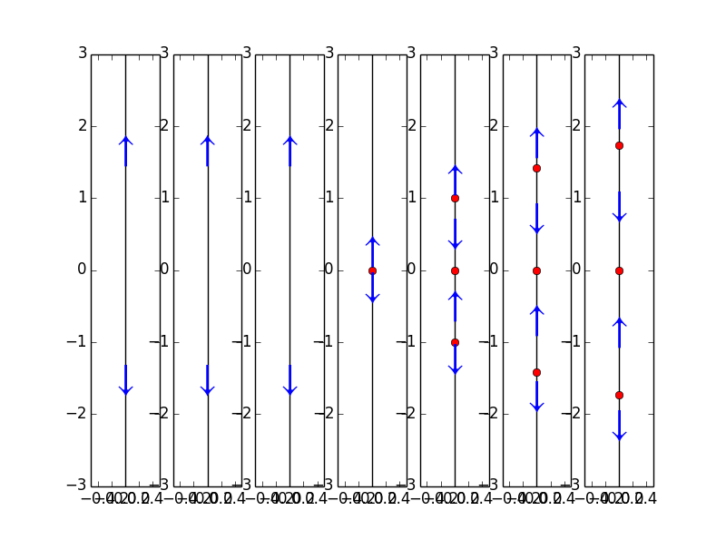
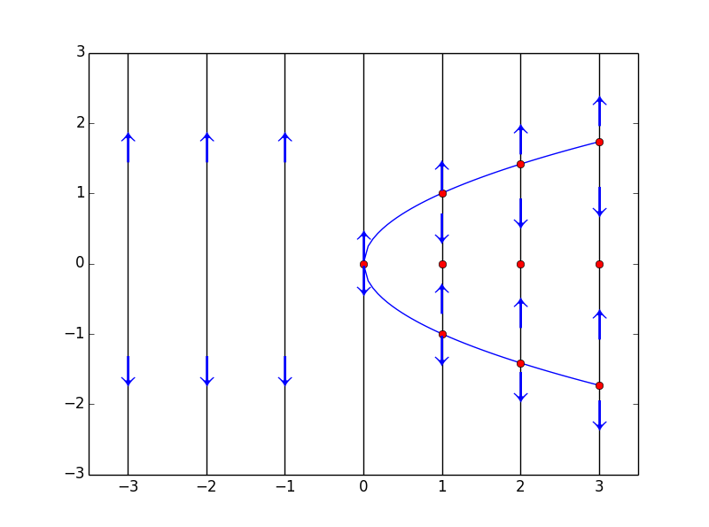
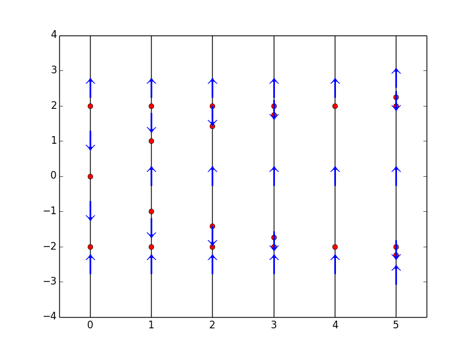

#**分歧（Bifurcations）**  
本节关注的是，根据参数值的不同，微分方程解的长远表现会有怎样的不同。  

分歧：参数值发生很小变化，解的长远表现发生很大的变化。

回顾之前介绍的罗吉斯特增长模型：
$$\frac{dP}{dt}=kP(1-\frac{P}{N})$$    
现假设用该模型描述养鱼场鱼类的繁殖，并考虑加入一个每年固定的捕鱼率$$C$$：
$$\frac{dP}{dt}=kP(1-\frac{P}{N})-C$$    
模型中参数有3个：$$k,N$$和$$C$$，假设$$k,N$$均限定不变，只余$$C$$是可变的，考察改变$$C$$的值，对方程解的长远表现有何影响。  

首先考虑到$$kP(1-\frac{P}{N})$$是开口朝下的抛物线，若要方程有平衡解，则需要$$C$$小于抛物线的最大值，即：  
$$C\leq \frac{kN}{4}$$  

考虑同类型方程中更简单一点的例子：  
$$\frac{dy}{dt}=y(1-y)-a$$  
其中$$a$$为参数,试看调整$$a$$的值，导致的相线变化： 

```
    y = Function('y')
    avals = [0, -0.125, -0.25, -0.375]
    formula = y(t)*(1-y(t))+a
    domain = np.linspace(-0.5,1.5)
    for i in range(len(avals)):
        plt.subplot(1, len(avals), i+1)
        phaseLine(formula.subs(a, avals[i]), [], domain, True)
```


如果将上图中各个红点链接起来就获得了**分歧图（bifurcation diagram）**，抛物线所向的一面是有平衡解的范围，相反则是无平衡解的范围，**分歧值（bifurcation value）**出现在$$a=\frac{1}{4}$$。称$$a<\frac{1}{4}$$的所有系统是**性质上等效（qualitatively equivalent）**，称$$a\geq \frac{1}{4}$$的所有系统是性质上等效的。

另一个例子：
$$\frac{dy}{dt}=y^3-ay$$  

```
    formula = y(t)**3-a*y(t)
    avals = [-3, -2,-1, 0, 1, 2, 3]
    domain = np.linspace(-3,3)
    
    for i in range(len(avals)):
        plt.subplot(1, len(avals), i+1)
        phaseLine(formula.subs(a, avals[i]), [], domain, True)
```




绘制其分歧图，则只需要将上图中红点链接起来即可。

```
    def bifurcationDiagram(formula, avals, ydomain = np.linspace(-3,3)):
        fig = plt.figure(num=1)
        plt.axis(xmin = min(avals)-0.5, xmax = max(avals)+0.5)
        solutions = solve(formula,y(t))
        try:
            solutions.pop(solutions.index(0))
            for s in solutions:
<<<<<<< HEAD
                adomain = np.linspace(float(solve(s, a)[0]), max(avals))
=======
            adomain = np.linspace(float(solve(s, a)[0]), max(avals))
>>>>>>> parent of 1a3b031... Update 08Bifurcations.md
            yvals = [s.subs(a,aval) for aval in adomain]
            plt.plot(adomain, yvals, color = 'blue')
        except:
            None
            
        for aval in avals:
            formli = formula.subs(a, aval)
            solutions = solve(Eq(formli,0),y(t))
            try:
                solutions.sort()
                ran = solutions[-1]-solutions[0]
                if len(solutions) == 1:
                    intervals = [solutions[0]-0.5, solutions[0], solutions[0]+0.5]
                else:
                    intervals = [float(solutions[0]-0.25*ran)]+solutions+[float(solutions[-1]+0.25*ran)]
            except:    
                if 0 in solutions:
                    signVals = [ydomain[12],ydomain[38]]
                else:
                    signVals = [0]
                solutions = []
        
            plt.plot([aval for dummy in ydomain],ydomain, color = 'black')
            plt.plot([aval for dummy in solutions], solutions, 'or')
        
            if solutions != []:
                for i in range(len(intervals)-1):
                    midpoint = (intervals[i]+intervals[i+1])/2.0
                    intervalSign = sign(formli.evalf(subs={'y(t)':midpoint}))
                    if intervalSign == -1:
                        plt.text(aval, midpoint, u'\u2193',fontname='STIXGeneral', color = 'blue', size=30, va='center', ha='center', clip_on=True)
                    elif intervalSign == 1:
                        plt.text(aval, midpoint, u'\u2191',fontname='STIXGeneral', color = 'blue', size=30, va='center', ha='center', clip_on=True)
            else:
                for val in signVals:
                    intervalSign = sign(formli.evalf(subs={'y(t)':val}))
                    if intervalSign == -1:
                        plt.text(aval, val, u'\u2193',fontname='STIXGeneral', color = 'blue', size=30, va='center', ha='center', clip_on=True)
                    elif intervalSign == 1:
                        plt.text(aval, val, u'\u2191',fontname='STIXGeneral', color = 'blue', size=30, va='center', ha='center', clip_on=True)
        return fig
        
    bifurcationDiagram(formula, avals, domain)
```
   

分歧点可能不止一个，例如：

$$\frac{dy}{dt}= (y^2-\alpha)(y^2-4)$$   
分歧点有两个，$$a=0$$和$$a=4$$  

见分歧图：

    


