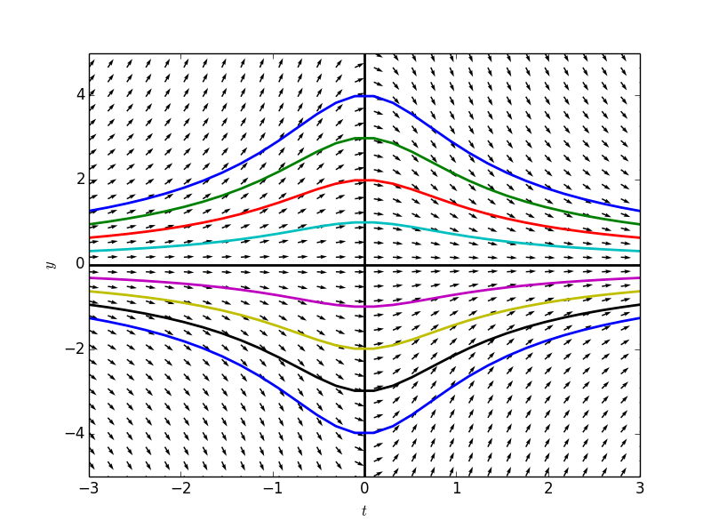
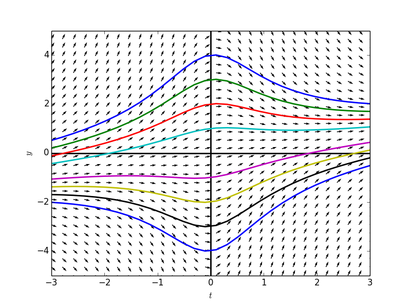
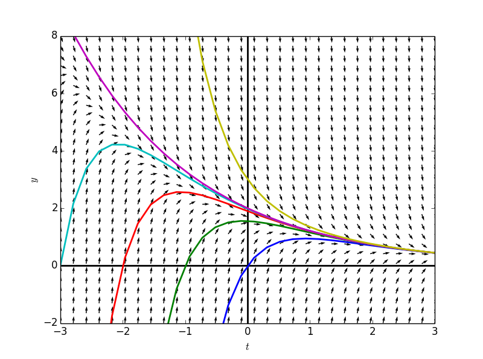
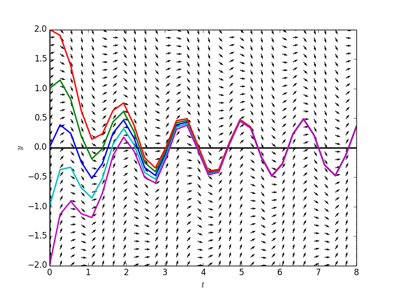
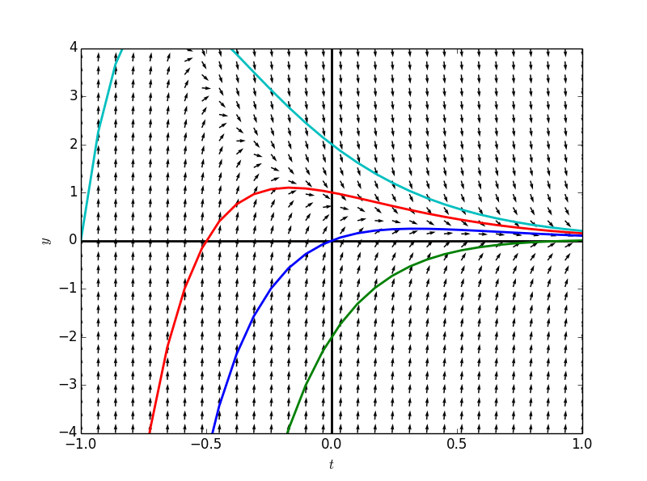

#9 线性微分方程
##9.1 **线性（linearity）**  
**例子**  
考虑如下问题：
一个容积$$200$$升的容器中有$$100$$升盐水，盐的含量为$$1000$$克。假设盐浓度$$35$$克每升的盐水以每分钟$$4$$升的速度注入容器，完全混合的溶液以每分钟$$2$$升的速度流出。  
用微分方程描述该容器内盐的含量，则盐含量的变化率为盐流入的速率减去盐流出的速率：  
$$\frac{ds}{dt}= 35\times 4 - 2\frac{s}{100+(4-2)t}\\
\qquad = 140 - \frac{s}{50+t}$$

加上$$s(0)=1000$$，我们便获得了一个初值问题。

本节内容便是讨论如何解这一类的微分方程。

**线性微分方程**  
我们称一阶微分方程$$\frac{dy}{dt}=f(t,y)$$是线性的，如果其可以写成如下形式：  
$$\frac{dy}{dt}=a(t)y+b(t)$$    
即右边能写成因变量(这里是$$y$$)的线性函数的形式。   

**齐次与非齐次**    
对于线性微分方程，又分两大类:    
1. **齐次（homogeneous）**,$$b(t)=0$$    
2. **非齐次（nonhomogeneous）**,$$b(t)\neq 0$$    
   
例如：
+ 线性且齐次：$$\frac{dy}{dt}=(cost)y$$  
+ 线性非齐次：$$\frac{dy}{dt}=y-t^2$$  
+ 非线性： $$\frac{dy}{dt}=y^2$$  

我们上面获得的盐水问题就是线性非齐次的。   

**线性齐次=可分**   
注意到线性齐次微分方程式是我们之前所提到的可分微分方程，可以通过两边同除以$$y$$后同时积分的方法来求解。  

$$\frac{dy}{dt}=a(t)y\\
\frac{1}{y}\frac{dy}{dt}=a(t)\\
\int \frac{1}{y}dy = \int a(t)dt$$    

看一个具体的线性齐次微分方程的例子：
$$\frac{dy}{dt}=\frac{-ty}{1+t^2}\\
\frac{1}{y} \frac{dy}{dt} = \frac{-t}{1+t^2} \\
\int \frac{1}{y} dy = \int \frac{-t}{1+t^2} dt \\
ln(y) = -\frac{1}{2}ln(1+t^2) + C\\
ln(y) = ln(\frac{1}{1+t^2}) + C\\
y = (\frac{1}{\sqrt{1+t^2}})(e^C)\\
y = (\frac{1}{\sqrt{1+t^2}})(C)\\
y(t) = \frac{C}{\sqrt{1+t^2}}$$  

斜率场和若干个解的图如：  

```
    tdomain = np.linspace(-3,3,30)
    ydomain = np.linspace(-5,5,30)
    
    y = Function('y')
    formula = -1*t*y(t)/(1+t**2)
    
    fg = plotSlopeField(tdomain,ydoman,formula,[(0,4),(0,3),(0,2),(0,1),(0,-1),(0,-2),(0,-3),(0,-4)])
    
    fg.show()
```



可以看出其各个解之间的差距只是$$k$$值得不同。如果获得了一个解，便可以通过乘以一个值得方法来获得任何一个其他解。  

**齐次微分方程的线性原理（The Linearity Principle for Homogeneous Equations）**    
如果$$y_h(t)$$是一个齐次线性微分方程$$\frac{dy}{dt}=a(t)y$$的解，那么将其乘以任何一个常数$$k$$获得的$$y_k(t)=ky_h(t)$$也同样是一个解。  

检该原理非常简单：

$$\frac{dy_k}{dt}=k(\frac{dy_h}{dt})\\
\qquad = k(a(t)y_h)\\
\qquad = a(t)(ky_h)\\
\qquad = a(t)(y_k(t))$$  

**一阶方程的扩展线性原理(The Extended Linearity Principle for First-Order Equations)**    

考虑一个一阶非齐次线性方程：
$$\frac{dy}{dt}=a(t)y + b(t)$$   
以及其对应的齐次方程：
$$\frac{dy}{dt}=a(t)y$$   

1. 如果$$y_h(t)$$是齐次方程的任意一个解，而$$y_p(t)$$是相应的非齐次方程的任意一个解，那么$$y_h(t)+y_p(t)$$也是该非齐次方程的一个解。   
2. 若$$y_h(t)$$和$$y_p(t)$$分别是非齐次方程的两个解，那么$$y_h(t)-y_p(t)$$是相应齐次方程的一个解。  

因此，如果$$y_h(t)$$非零，则$$ky_h(t)+y_p(t)$$是非齐次方程的一般解。  

即：

**一个非齐次线性方程的一般解可由（非齐次方程的任意一个解）和（相应齐次方程的一般解）相加获得**   
    
例子，非齐次线性方程：
$$\frac{dy}{dt}=\frac{-ty}{1+t^2}+\frac{2t^2+1}{4t^2+4}$$  
现在知道其有一个特殊解$$y_p(t)=\frac{t}{4}$$  

通过上面，我们已经知道对应的齐次线性方程的一般解为：
$$y(t) = \frac{C}{\sqrt{1+t^2}}$$

因此上述非齐次方程的其一般解为:
$$y(t) = \frac{t}{4} + \frac{C}{\sqrt{1+t^2}}$$

```
    from sympy.abc import C
    formula = -1*t*y(t)/(1+t**2) + (2*t**2+1)/(4*t**2+4)
    solutions = t/4+C/(1+t**2)**0.5
    points = [(0,4),(0,3),(0,2),(0,1),(0,-1),(0,-2),(0,-3),(0,-4)]
    
    
    fig = plt.figure(num=1)
    # create grid
    T,Y = np.meshgrid(tdomain,ydomain )
    # calculate slope vectors
    U = 1
    V = np.array([[formula.subs({y(t): yval, t: tval}) for tval in tdomain] for yval in ydomain],dtype = 'float')
    N = np.sqrt(U**2+V**2)
    U2, V2 = U/N, V/N
    # make the plot
    plt.quiver( T,Y,U2, V2)
    plt.xlabel(r"$t$")
    plt.ylabel(r"$y$")
    plt.axhline(0,0,1,linewidth = 2, color = 'black')
    plt.axvline(0,0,1,linewidth = 2, color = 'black')
    
    for p in points:
        Cval = solve(Eq(solutions.subs(t,p[0]),p[1]))[0]
        solution = solutions.subs(C,Cval)
        plt.plot(tdomain, np.array([solution.subs(t,tval) for tval in tdomain],dtype= 'float'),
                        linewidth = '2')
    
            # limiting the axes
        plt.xlim([tdomain[0],tdomain[-1]])
        plt.ylim([ydomain[0],ydomain[-1]])
```



这个非齐次的线性方程的斜率场和解，可以看成是对应的齐次线性方程斜率场合解调整后的结果。  

例题：
若已知$$y_p(t)=\frac{a}{t^2}$$是微分方程$$\frac{dy}{dt}=2ty-\frac{6}{t^2}-\frac{6}{t^3}$$的一个特殊解，(1)求$$a$$的值,(2)求方程的一般解，(3)求$$y(1)=3+2e$$初值问题的解。  

(1):
$$\frac{dy_p(t)}{dt}=\frac{d}{dt}\frac{a}{t^2}\\
\qquad = -2at^{-3}$$

$$\frac{dy}{dt}=2ty-\frac{6}{t^2}-\frac{6}{t^3}\\
\qquad = 2t\frac{a}{t^2}-\frac{6}{t^2}-\frac{6}{t^3}\\
\qquad = \frac{2a-6}{t}-\frac{6}{t^3}$$  

因此有：$$\frac{2a-6}{t}-\frac{6}{t^3}= -2at^{-3}$$
求解出：$$a=3$$

因此得到非齐次线性方程的一个一般解：$$\frac{3}{t^2}$$    

(2):
对应的齐次线性方程为：$$\frac{dy}{dt}=2ty$$

用分离变量法不难求得其一般解为：$$Ce^{t^2}$$

因此非齐次方程的一般解为：$$y(t)=y_p(t)+y_h(t)=\frac{3}{t^2}+Ce^{t^2}$$

(3) 
带入初值到一般解中，求出$$C=2$$，因此初值问题解为：$$y(t)=\frac{3}{t^2}+2e^{t^2}$$


##9.2 猜解法
对于一个给定的非齐次线性方程，通过如下方法求解一般解：
1. 解对应的齐次线性方程
2. 猜测出非齐次方程的一个特殊解
3. 将两者相加获得非齐次线性方程的一般解  

例子：
$$\frac{dy}{dt}= -2y+3e^{-t/2}$$  
对应的齐次方程为：
$$\frac{dy}{dt}=-2y$$  
其一般解为：$$y(t)=Ce^{-2t}$$  

对非齐次方程进行变换
$$\frac{dy}{dt}+2y=3e^{-\frac{t}{2}}$$
考虑什么函数求导后加上2倍的本身可以获得$$3e^{-\frac{t}{2}}$$  

猜测：$$y_p=\alpha e^{-t/2}$$
$$\frac{dy_p}{dt}+2y_p\\
\qquad = -\frac{\alpha}{2}e^{-\frac{t}{2}}+2\alpha e^{-\frac{t}{2}}\\
\qquad = \frac{3}{2}\alpha e^{-\frac{t}{2}}$$  
在$$\alpha = 2$$时，$$y_p(t)= 2e^{-\frac{t}{2}}$$为非齐次方程的一个特殊解，因此获得一般解为：
$$y(t)=2e^{-\frac{t}{2}}+Ce^{-2t}$$   

看一看方程的解和斜率场,洋红色的一条线代表的是上面我们求出的特殊解，注意到所有的解在随着$$t\rightarrow \infty$$时，都在趋近于我们求出来的特殊解：
```
    tdomain = np.linspace(-3,3,30)
    ydomain = np.linspace(-2,8,30)
    formula = -2*y(t)+3*sympy.E**(-1*t/2)
    fg = plotSlopeField(tdomain,ydomain,formula,[(0,0),(-1,0),(-2,0),(-3,0),(0,2),(0,3)])
    fg.show()
```
  

例子2：

$$\frac{dy}{dt}=-y+2cos(4t)$$  
对应齐次方程的一般解为：$$y_h(t)=Ce^{-t}$$  

猜测:$$y_p = \alpha cos4t + \beta sin4t$$
$$\frac{y_p}{t}+y\\
\qquad = 4\alpha sin4t -4\beta cos4t + \alpha cos4t + \beta sin4t\\
\qquad = (4\alpha + \beta)sin4t + (\alpha - 4\beta)cos4t$$  
要使得其等于$$2cos4t$$，获得方程组：
$$\begin{cases} 4\alpha+\beta = 0\\ \alpha-4\beta =2 \end{cases}\\
\implies\\
\begin{cases} \alpha = \frac{2}{17} \\ \beta = \frac{8}{17} \end{cases}$$
因此获得非齐次方程的特殊解：
$$y_p(t) = \frac{2}{17}cos4t + \frac{8}{17}sin4t$$  
方程的一般解为：
$$y(t)=\frac{2}{17}cos4t + \frac{8}{17}sin4t+Ce^{-t}$$   

看一看方程的解和斜率场,蓝色的一条线代表的是上面我们求出的特殊解，注意到所有的解在随着$$t\rightarrow \infty$$时，都在趋近于我们求出来的特殊解，因此这个特殊解又称为**稳态解（steady state solution）**：
```
    tdomain = np.linspace(-3,3,30)
    ydomain = np.linspace(-2,8,30)
    formula = -2*y(t)+3*sympy.E**(-1*t/2)
    fg = plotSlopeField(tdomain,ydomain,formula,[(0,0),(-1,0),(-2,0),(-3,0),(0,2),(0,3)])
    fg.show()
```
 


例子3：
$$\frac{dy}{dt}=-3y+2e^{-3t}$$    
相应齐次方程的一般解为:$$Ce^{-3t}$$     
猜测$$y_p(t)=\alpha e^{-3t}$$，将不会有效果，我们永远不应该猜测齐次方程的解为对应非齐次方程的解。    
而是猜测：$$y_p(t)=\alpha t e^{-3t}$$         
$$\frac{dy_p}{dt}+3y_p = \alpha (e^{-3t}-3te^{-3t}) + 3\alpha t e^{-3t}\\
\qquad = \alpha e^{-3t}$$ 
要其为$$2e^{-3t}$$，则需要$$\alpha = 2$$ 

因此特殊解为：$$y_p(t) = 2te^{-3t}$$    
一般解为：$$(k+2t)e^{-3t}$$    

同样看看图：
```
    tdomain = np.linspace(-1,1,30)
    ydomain = np.linspace(-4,4,30)
    formula = -3*y(t)+2*sympy.E**(-3*t)
    fg = plotSlopeField(tdomain,ydomain,formula,[(0,0),(0,-2),(0,1),(0,2)])
```
 

